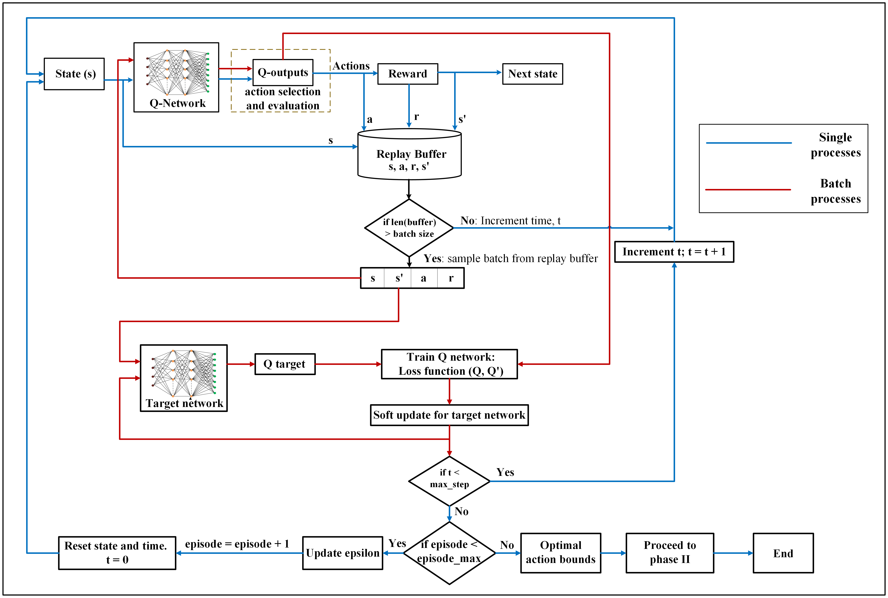
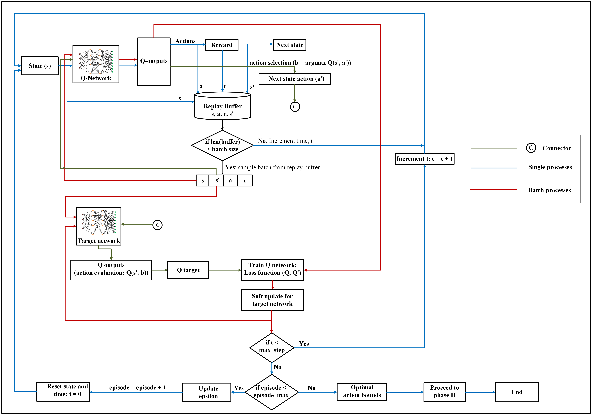
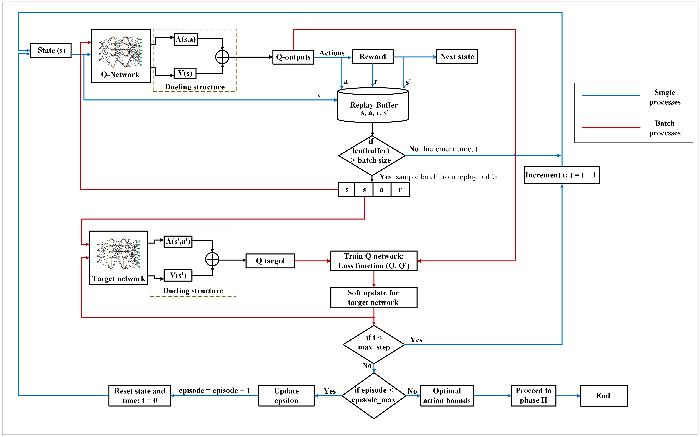
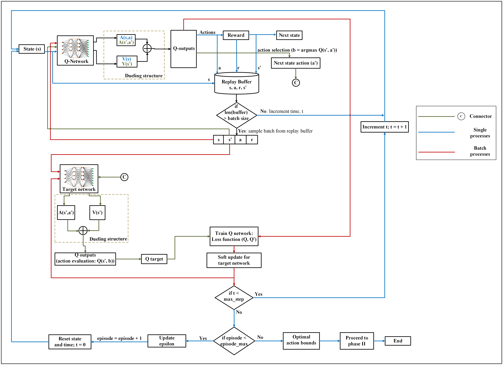

# Augmented Deep Reinforcement Learning for the Energy Management of Microgrids


This repository provides the research code, datasets, and algorithmic workflows for a two-phase augmented energy management framework for microgrids. The framework combines **deep reinforcement learning (DRL)** with **quadratic programming (QP)** to support fast, constraint-aware, and cost-effective microgrid scheduling under renewable energy uncertainty.

The main idea is to use value-based DRL agents to learn feasible operating regions for a microgrid, then refine the learned discrete decisions through QP to obtain continuous and operationally meaningful dispatch schedules.

---

## Project Overview

This project implements and compares four value-based DRL algorithms for microgrid energy management:

1. **Deep Q-Network (DQN)** for approximate Q-value learning with experience replay and a target network.
2. **Double Deep Q-Network (DDQN)** for reducing action-value overestimation during Q-learning.
3. **Dueling Deep Q-Network (D2QN)** for separating state-value and action-advantage estimation.
4. **Dueling Double Deep Q-Network (D3QN)** for combining double Q-learning with dueling network decomposition.

The project also includes a **genetic algorithm (GA)** benchmark to compare the proposed augmented DRL framework with a classical optimization-based baseline.

The repository is designed for researchers and practitioners working on microgrid control, reinforcement learning, renewable energy integration, battery energy storage, and real-time energy management systems.

---

## Associated Publication

This repository accompanies the following research article:

> Esan, A. B., & Shareef, H. (2025). **Augmented deep reinforcement learning for the energy management of microgrids considering renewable stochastic parameters**. *Engineering Applications of Artificial Intelligence*, 162, Article 112785. https://doi.org/10.1016/j.engappai.2025.112785

---

## Project Requirements

### Research Objective

Develop an augmented DRL-QP energy management framework that learns high-quality dispatch actions for a microgrid and refines them into feasible continuous schedules while accounting for renewable stochastic parameters and operational constraints.

### Technical Specifications

- **Microgrid resources**: diesel generators, photovoltaic generation, battery energy storage, utility grid exchange, and aggregated load demand.
- **State variables**: renewable generation, load demand, electricity price, and battery state of charge.
- **Action variables**: generator output levels, generator commitment states, grid power exchange, and battery charge/discharge decisions.
- **Learning agents**: DQN, DDQN, D2QN, and D3QN.
- **Optimization layer**: QP-based refinement of DRL-derived action bounds.
- **Benchmarking method**: GA-based optimization baseline.
- **Performance goals**: reduce operating cost, limit constraint violations, and support rapid scheduling decisions suitable for real-time or near-real-time energy management.

---

## Methodological Framework

The proposed workflow is organized into two computational phases.

### Phase I: DRL-Based Feasible Action Region Learning

Each DRL agent interacts with the microgrid environment and learns a policy that maps system states to dispatch actions. The reward function penalizes operating costs and infeasible decisions, encouraging the agent to identify action regions that satisfy the physical and economic requirements of the microgrid.

### Phase II: QP-Based Dispatch Refinement

The action regions learned by the DRL agent are passed to a QP refinement stage. This second phase converts discrete or bounded DRL decisions into continuous dispatch schedules that better represent practical microgrid operation.

---

## Value-Based DRL Algorithms

The following diagrams summarize the four value-based learning structures implemented in this repository. Place the supplied figures in `docs/figures/` using the exact filenames shown below.

### 1. Deep Q-Network (DQN)

<p align="center">
  
</p>

DQN approximates the action-value function with a neural network. The agent observes the current microgrid state, selects an action through an exploration-exploitation policy, stores the transition in replay memory, and trains the Q-network using sampled mini-batches. A target network stabilizes the value update process.

### 2. Double Deep Q-Network (DDQN)

<p align="center">
  
</p>

DDQN improves DQN by separating action selection from action evaluation. The online Q-network selects the best next action, while the target network evaluates that action. This reduces overestimation bias and can improve training stability in microgrid scheduling problems with large action spaces.

### 3. Dueling Deep Q-Network (D2QN)

<p align="center">
  
</p>

D2QN introduces a dueling architecture that decomposes Q-value estimation into a state-value stream and an action-advantage stream. This enables the agent to learn how valuable a microgrid state is separately from the relative benefit of each dispatch action in that state.

### 4. Dueling Double Deep Q-Network (D3QN)

<p align="center">
  
</p>

D3QN combines the strengths of DDQN and D2QN. It uses double Q-learning to reduce overestimation bias and a dueling network structure to improve value representation. This architecture is particularly useful when many actions have similar effects in some operating states but differ sharply in others.

---

## Case Study and Data Description

The case study evaluates the energy management of a realistic microgrid under uncertain renewable and demand conditions. The repository includes training and testing data for the DRL agents and benchmark optimization model.

| Component | Description |
|---|---|
| Energy management target | Cost-effective microgrid dispatch |
| Learning setting | Markov decision process for sequential dispatch decisions |
| DRL algorithms | DQN, DDQN, D2QN, and D3QN |
| Benchmark | Genetic algorithm optimization |
| Training data | January hourly microgrid dataset |
| Testing data | 2020 scenario files for demand, electricity price, and solar irradiance |
| Dispatch horizon | 24-hour microgrid scheduling |
| Main controlled assets | Diesel generators, battery energy storage, grid exchange, and solar PV |

---

## Repository Structure

```text
Augmented-Deep-Reinforcement-Learning-for-the-Energy-Management-of-Microgrids/
|
|-- DQN Agent Code/
|   |-- DQN_code.ipynb
|   |-- solar_microgrid_env.py
|
|-- DDQN Agent Code/
|   |-- DDQN_code.ipynb
|   |-- solar_microgrid_env.py
|
|-- D2QN Agent Code/
|   |-- D2QN_code.ipynb
|   |-- solar_microgrid_env.py
|
|-- D3QN Agent Code/
|   |-- D3QN_code.ipynb
|   |-- solar_microgrid_env.py
|
|-- GA Benchmark Code/
|   |-- GA_code.ipynb
|
|-- Training Dataset/
|   |-- Jan_hourly_data_combined_all_modified.csv
|
|-- Testing Dataset/
|   |-- scenario_demand_data_2020.pickle
|   |-- scenario_price_data_2020.pickle
|   |-- scenario_solar_data_2020.pickle
|
|-- docs/
|   |-- figures/
|       |-- DQN.png
|       |-- DDQN.png
|       |-- D2QN.png
|       |-- D3QN.png
|
|-- LICENSE
|-- README.md
```

---

## Software Requirements

The notebooks can be run in Google Colab or in a local Jupyter environment. A typical local setup requires Python 3.10 or later.

Install the main scientific, learning, and optimization packages with:

```bash
python -m pip install numpy pandas scipy matplotlib scikit-learn torch cvxpy geneticalgorithm notebook ipykernel
```

Core package roles are summarized below.

| Package | Purpose |
|---|---|
| `numpy`, `pandas` | Numerical computation and data handling |
| `matplotlib` | Visualization of training and dispatch results |
| `torch` | Neural network implementation for DRL agents |
| `scipy`, `cvxpy` | Optimization and QP-related computations |
| `geneticalgorithm` | GA benchmark implementation |
| `pickle` | Loading saved testing scenarios |
| `notebook`, `ipykernel` | Running the project notebooks |

For GPU-based experiments, install the PyTorch build that matches your CUDA version.

---

## How to Run the Project

### 1. Clone the repository

```bash
git clone https://github.com/esanben/Augmented-Deep-Reinforcement-Learning-for-the-Energy-Management-of-Microgrids.git
cd Augmented-Deep-Reinforcement-Learning-for-the-Energy-Management-of-Microgrids
```

### 2. Create a Python environment

```bash
python -m venv .venv
source .venv/bin/activate
python -m pip install --upgrade pip
python -m pip install numpy pandas scipy matplotlib scikit-learn torch cvxpy geneticalgorithm notebook ipykernel
```

On Windows, activate the environment with:

```bash
.venv\Scripts\activate
```

### 3. Run a DRL agent

Open the notebook corresponding to the desired agent:

```text
DQN Agent Code/DQN_code.ipynb
DDQN Agent Code/DDQN_code.ipynb
D2QN Agent Code/D2QN_code.ipynb
D3QN Agent Code/D3QN_code.ipynb
```

Each notebook trains or evaluates a DRL agent within the microgrid environment defined in `solar_microgrid_env.py`.

### 4. Run the GA benchmark

Open and execute:

```text
GA Benchmark Code/GA_code.ipynb
```

The GA notebook uses the testing scenario files for demand, price, and solar irradiance. If a notebook expects data files in the active working directory, either copy the required files from `Testing Dataset/` into the notebook directory or update the file paths inside the notebook.

---

## Expected Outputs

Depending on the notebook executed, the project workflow can produce:

- Training reward trajectories for each DRL agent.
- Learned action selections or feasible action bounds.
- Microgrid dispatch schedules for generators, grid power, and battery operation.
- Operating cost comparisons across DQN, DDQN, D2QN, D3QN, and GA.
- Runtime and constraint-violation summaries for algorithmic benchmarking.

---

## Reported Study Highlights

The associated paper reports that the DDQN agent achieved the best overall performance among the four DRL variants during training and testing. In the reported experiments, DDQN obtained the lowest testing cost and zero constraint violations, while all DRL-based approaches achieved faster runtimes and lower operating costs than the GA benchmark.

For full numerical results, sensitivity analyses, and methodological derivations, please refer to the associated publication.

---

## Research Applications

This repository can support further work in:

- DRL-based energy management for microgrids.
- Real-time or near-real-time dispatch of distributed energy resources.
- Hybrid learning-optimization frameworks for power systems.
- Constraint-aware reinforcement learning in engineering systems.
- Comparative evaluation of value-based DRL algorithms for energy scheduling.

---

## Citation

If you use this repository or build upon the associated methodology, please cite:

```text
A. B. Esan and H. Shareef, "Augmented deep reinforcement learning for the energy management of microgrids considering renewable stochastic parameters," Engineering Applications of Artificial Intelligence, vol. 162, Article 112785, 2025. doi: 10.1016/j.engappai.2025.112785.
```

---

## License

This project is licensed under the [MIT License](LICENSE). You are free to use, modify, and share this project with proper attribution.

---

## About Me

I'm **Ayodele Benjamin Esan**. I hold a doctorate in Electrical Engineering with a focus on Deep Reinforcement Learning applications in Energy Systems. I am passionate about using data, optimization, and intelligent agents to build robust decision-making systems for modern energy networks.

Feel free to connect with me on:

[](https://www.linkedin.com/in/ayodele-benjamin-esan-ph-d-03b948106)
[](https://github.com/esanben)
[](https://medium.com/@esanayodele.benjamin)
